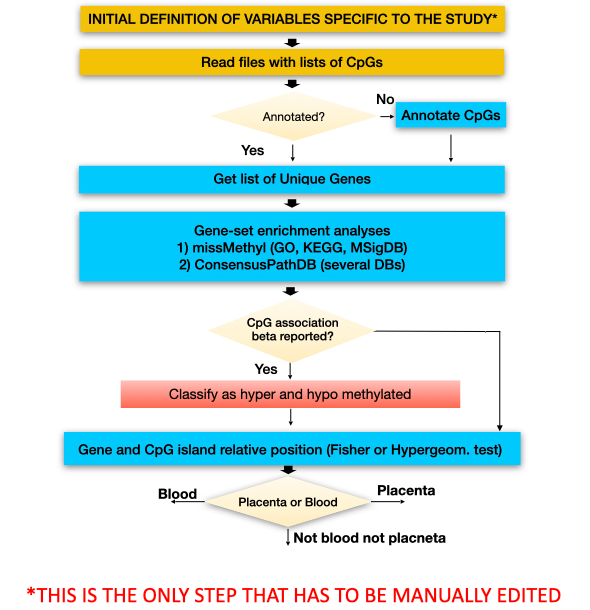

```{r setup_knitr, include=FALSE}
knitr::opts_chunk$set(message = FALSE, warning = FALSE,
                      cache=TRUE)
library(knitr)
library(tools)
```

```{r textformat, include=FALSE, eval=TRUE}
colorize <- function(x, color) {
  if (knitr::is_latex_output()) {
    sprintf("\\textcolor{%s}{%s}", color, x)
  } else if (knitr::is_html_output()) {
    sprintf("<span style='color: %s;'>%s</span>", color, 
      x)
  } else x
}
```

# Prerequisites

The package requires other packages to be installed. These include: `ggplot2`, `VennDiagram`, `RColorBrewer`, `tibble`, `dplyr`, `stringr`, `rasterpdf`, `tidyverse`, `reshape`, `ggsignif`, `tools` and `meta` all available in CRAN. The package also requires other packages from Bioconductor to perform annotations and enrichment : `IlluminaHumanMethylation450kanno.ilmn12.hg19`, `IlluminaHumanMethylationEPICanno.ilm10b4.hg19`, `missMethyl`, `org.Hs.eg.db`, `GenomicRanges` and `rtracklayer`.

To perform meta-analyses we use GWAMA, a Software tool for meta analysis developed by Intitute of Genomics from University of Tartu, this software is available at [https://genomics.ut.ee/en/tools/gwama-download](https://genomics.ut.ee/en/tools/gwama-download), this software must be installed on the computer where we are running analysis (already installed in machines ws05 and ws06 from ISGlobal).

# Overview

The EASIER package performs epigenetic wide-association study (EWAS) downstream analysis:

* Quality control of EWAS results
   + Folders: input and ouput
   + Configuration: array type, sample, ethnic, exclusion CpGs criteria
   + CpG filtering selection -> list of CpGs filtered and reason
   + QC with summaries -> summary SE, Beta, lambda, significatives...
   + QC with plots -> QQplot, Distribution plot, precision plot, ...
   + CpG annotation and adjustment -> QCed EWAS results file

* Meta-analysis of EWAS results (using GWAMA)
   + Folders: input and output
   + Link to GWAMA
   + Format QCed EWAS results file
   + Run GWAMA -> EWAS meta-analysis results file
   + Meta-analysis with summaries -> xxxxxxx
   + Meta-analysis with plots -> Heterogeneity plot, distribution plots, QQ-plots, Volcano plots, Manhattan plots andForest plots, 

* Functional enrichment (pathway and molecular enrichments)
   + GO and KEGG and MolSig
   + Pathways with Molecular Signatures Database (MSigDB)
   + ConsensusPath Data Base
   + Gene relative position
   + CpG island relative position
   + Specific for Blood : 
      - 15 ROADMAP chromatine states
   + Specific for Placenta : 
      - ROADMAP chromatine states Fetal Placenta 15 and 18  
      - Partially methylated domains (PMDs)
      - Impreinted regions


In this vignette we will show how to apply EASIER con the EWAS results from  three cohorts and two distinct models for each cohort.


# Getting started

To install the required packages input the following commands to the R console:

```{r installDependences, eval=FALSE}
# Install devtools
install.packages("devtools")

# Install required packages 
devtools::source_url("https://raw.githubusercontent.com/isglobal-brge/EASIER/HEAD/installer.R")

# Install EASIER package
devtools::install_github("isglobal-brge/EASIER@HEAD")
```

The previous commands will install a library called `devtools` that is needed to source online scripts and run them. The next line sources a file that installs all the required packages from R-cran and Bioconductor to run EASIER, finally the package EASIER is installed.

```{r loadMethyTools, eval=TRUE}
library(EASIER)
library(readtext)
```


# Quality control


## Quality Control Flowchart


```{r qcworkflow, echo=FALSE, out.width='100%',  fig.align='center',  fig.cap="\\label{fig:qcworkflow}Quality control flowchart. This flowchart is used in the script under test folder to perform the quality control (QualityControl.R). The most important step in this workflow is the first step where we have to define the variables, if variables are well defined all the process is 'automatic' ", fig.pos='ht'}
include_graphics("imgs/workflows/QCWorkflow.png") 
```

We have programmed the script [QualityControl.R](https://github.com/isglobal-brge/EASIER/blob/main/test/QualityControl.R) using the library functions to carry out the *quality control process* automatically only by defining the previous variables. The script follows the **Figure\@ref(fig:qcworkflow)** workflow. In this vignette we will explain how the script works to allow you to modify if necessary.


## Initial Variables definition


We need to define the variables to work in all Quality control process, and the files containing the results of the EWAS to perform the downstream analysis.

### Input data

As we commented before, we will perform an EWAS with three different cohorts and two distinct models for each cohort, so we need to define where the data is stored for each model and each cohort (six files). We do that in a character vector, and the variable is called files:

```{r QC_varfiles}

files <- c('data/PROJ1_Cohort3_Model1_date_v2.txt',
           'data/PROJ1_Cohort3_Model2_date_v2.txt',
           'data/PROJ1_Cohort2_Plate_ModelA1_20170309.txt',
           'data/PROJ1_Cohort2_Plate_ModelA2_20170309.txt',
           'data/Cohort1_Model1_20170713.txt',
           'data/Cohort1_Model2_20170713.txt')
```

files must contain at least the following fields : 


probeID   | BETA | SE | P_VAL
------- | ----- | ----- | -----
cg13869341 | 0.00143514362777834 | 0.00963411132344512 | 0.678945643213567
cg24669183 | -0.0215342789035512 | 0.0150948404044624 | 0.013452341234512
cg15560884 | 0.00156725345562218 | 0.0063878467810596 | 0.845523221223523


### Where to store output

We can also define the folder where we will save the results, for example in a variable called `result_folder`, in this case the results will be stored stored in a folder named *QC_Results*.

```{r QCVarres}
# Result folder
results_folder <- 'QC_Results'
```

### Make results understandable

To make the analysis more understandable and do not have very complex file names we have to define an abbreviated form for each of the files defined above. For example, PROJ1_Cohort3_Model1_date_v2 will be treated as PROJ1_Cohort3_A1 or PROJ1_Cohort2_Plate_ModelA1_20170309 as PROJ1_Cohort2_A2 The length of the prefix vector must be equal to that of the files indicated above:

```{r QCVarPrefix}
# Prefixes for each file
prefixes <- c('PROJ1_Cohort3_A1', 'PROJ1_Cohort3_A2',
              'PROJ1_Cohort2_A1','PROJ1_Cohort2_A2', 
              'Cohort1_A1', 'Cohort1_A2')
```


### Illumina Array type and filter conditions

The Illumina array type has to be indicated with one of these two possible values: 450K and EPIC. Filter CpGs is dependent on the Illumina array, thus this field has to be completed. 

```{r QCVarartype}
# Array type, used : EPIC or 450K
artype <- '450K'
```

In the quality control (QC) process, we exclude those CpGs that do not accomplish the defined parameters (based on *Zhou et al. 2017, Solomon et al. 2018, Fernandez-Jimenez et al. 2019*). These parameters are defined in a character vector and are the following:

#### Perform CpG exclusions –> non CpG probes and sexual CpGs:

  * **Control probes ("control_probes")**: technical control probes that do not correspond to CpGs, such as bisulfite conversion I, bisulfite conversion II, extension, hybridization and negative. Classified as "rs" in the filtering variable named "probeType";
  * **Non-cpg probes ("noncpg_probes")**: non-cpg probes classified as "ch" in the filtering variable named "probeType";
  * **Sex chromosomes ("Sex")**: to avoid misleading results due to differences in sex-chromosome dosage on the human methylome. Filtering variable "Sex"; #

#### Perform CpG exclusions –> hybridizing problems:

  * **Poor mapping probes ("MASK_mapping")**: Probes that have poor quality mapping to the target genomic location as indicated in the array’s manifest file based on genome build GRCh37 and GRCh38 (for example due to the presence of INDELs (Insertion–deletion mutations present in the genome); 
  * **Cross-hybridising probes ("MASK_sub30")**: The sequence of the last 30bp at the 3’ end of the probe is non-unique (problematic because the beta value of such probes is more likely to represent a combination of multiple sites and not the level of initially targeted CpG sites); Zhou et al. recommend 30bp, but in the code we prepared there is the possibility to adapt this to probes with non-unique 25bp, or 35bp, or 40bp, or 45bp 3’-subsequences (**"MASK_sub25", "MASK_sub40", "MASK_sub45"**).

#### Perform CpG exclusions -> presence of SNPs:

  * **"MASK_extBase"**: Probes with a SNP altering the CpG dinucleotide sequence context and hence the ability of target cytosines to be methylated (regardless of the MAF); 
  * **"MASK_typeINextBaseSwitch"**: Probes with a SNP in the extension base that causes a color channel switch from the official annotation (regardless of the MAF); 
  * **"MASK_snp5.GMAF1p"**: probes with SNPs at the last 5bp of the 3’ end of the probe, with an average minor allele frequency (MAF) >1%, by ethnic group; 
  * **"MASK_snp5.common"**: probes with SNPs at the last 5bp of the 3’ end of the probe, with any average minor allele frequency (MAF) (can be <1%), by ethnic group;

#### Perform CpG exclusions -> array consistency:

  * **"Unrel_450_EPIC_blood"**: These are probes that are known to yield different results for the 450K and EPIC array in BLOOD, suggesting that results are unreliable for at least one of these arrays. CpGs based on Solomon et al. (2018).
  * **"Unrel_450_EPIC_pla_restrict"** or **"Unrel_450_EPIC_pla"**: These are probes that are known to yield different results for the 450K and EPIC array in PLACENTA, suggesting that results are unreliable for at least one of these arrays. CpGs based on Fernandez-Gutierrez et al. (2019).
 
In this example we filter CpGs that meet the following conditions: MASK_sub35_copy, MASK_typeINextBaseSwitch, noncpg_probes, control_probes, Unreliable_450_EPIC and Sex.


```{r QCVarexclude}
# Parameters to exclude CpGs
exclude <- c( 'MASK_sub35_copy', 
              'MASK_typeINextBaseSwitch', 
              'noncpg_probes', 
              'control_probes', 
              'Unrel_450_EPIC_blood', 
              'Sex')
```

We also need to define the ethnic origin of the study population. Ethnic origins can be one of the table or *GMAF1p* if population is very diverse.

| **Population Code** | **Population Description                                            ** | **Super Population Code** |
| :-------------------: | :---------------------------------------------------------------------- | :-------: |
| AFR                   | *African*                                                               | AFR       |
| AMR                   | *Ad Mixed American*                                                     | AMR       |
| EAS                   | *East Asian*                                                            | EAS       |
| EUR                   | *European*                                                              | EUR       |
| SAS                   | *South Asian*                                                           | SAS       |
| CHBB                  | Han Chinese in Beijing, China                                           | EAS       |
| JPT                   | Japanese in Tokyo, Japan                                                | EAS       |
| CHS                   | Southern Han Chinese                                                    | EAS       |
| CDX                   | Chinese Dai in Xishuangbanna, China                                     | EAS       |
| KHV                   | Kinh in Ho Chi Minh City, Vietnam                                       | EAS       |
| CEU                   | Utah Residents (CEPH) with Northern and Western European Ancestry       | EUR       |
| TSI                   | Toscani in Italia                                                       | EUR       |
| FIN                   | Finnish in Finland                                                      | EUR       |
| GBR                   | British in England and Scotland                                         | EUR       |
| IBS                   | Iberian Population in Spain                                             | EUR       |
| YRI                   | Yoruba in Ibadan, Nigeria                                               | AFR       |
| LWK                   | Luhya in Webuye, Kenya                                                  | AFR       |
| GWD                   | Gambian in Western Divisions in the Gambia                              | AFR       |
| MSL                   | Mende in Sierra Leone                                                   | AFR       |
| ESN                   | Esan in Nigeria                                                         | AFR       |
| ASW                   | Americans of African Ancestry in SW USA                                 | AFR       |
| ACBB                  | African Caribbeans in Barbados                                          | AFR       |
| MXL                   | Mexican Ancestry from Los Angeles USA                                   | AMR       |
| PUR                   | Puerto Ricans from Puerto Rico                                          | AMR       |
| CLM                   | Colombians from Medellin, Colombia                                      | AMR       |
| PEL                   | Peruvians from Lima, Peru                                               | AMR       |
| GIH                   | Gujarati Indian from Houston, Texas                                     | SAS       |
| PJL                   | Punjabi from Lahore, Pakistan                                           | SAS       |
| BEBB                  | Bengali from Bangladesh                                                 | SAS       |
| STU                   | Sri Lankan Tamil from the UK                                            | SAS       |
| ITU                   | Indian Telugu from the UK                                               | SAS       |
|                       |                                                                         |           |
| GMAF1p                | If population is very diverse                                           |           |


```{r QCVarethnic}
ethnic <- 'EUR'
```


### Other variables :

To obtain the precision plot and to perform the GWAMA meta-analysis we need to know the number of samples in the EWAS results, so we store this information in ”N”for each of the files. In addition, for case-control EWAS, we need to know the sample size of exposed or diseased individuals. This informaiotn is storaed as “n” for each of the files


```{r QCVarN}
N <- c(100, 100, 166, 166, 240, 240 )
n <- c(NA)
```

## Quality Control - general code

As we show in the quality control flowchart, this code can be executed for each file defined in previous variable `files` but in this example we only show the analysis workflow for one of them. The complete code can be found in [QualityControl.R](https://github.com/isglobal-brge/EASIER/blob/main/test/QualityControl.R) .

```{r QCCode1}

# Variable declaration to perform precision plot
medianSE <- numeric(length(files))
value_N <- numeric(length(files))
cohort_label <- character(length(files))

# Prepare output folder for results (create if not exists)
if(!dir.exists(file.path(getwd(), results_folder )))
   suppressWarnings(dir.create(file.path(getwd(), results_folder)))


# IMPORTANT FOR A REAL ANALYSIS :

# To show the execution flow we perform the analysis with only one data
# file. Normally, we have more than one data file to analyze, for that
# reason, we execute the code inside a loop and we follow the execution
# flow for each file defined in `files` 
# So we need to uncomment the for instruction and remove i <- 1 assignment.

# for ( i in 1:length(files) )
# {

   # we force i <- 1 to execute the analysis only for the first variable
   # for real data we have to remove this line
   i <- 1

```

First, we need to read the content of a file with EWAS results,

```{r QCCodeRead}
   
# Read data.
cohort <- read.table(files[i], header = TRUE, as.is = TRUE)
print(paste0("Cohort file : ",files[i]," - readed OK", sep = " "))
```

and store the content of the file in a `cohort` variable.  After that, we perform a simple descriptive analysis, using the function `descriptives_CpGs`. This function needs the EWAS results to be analyzed (`cohort`), the fields for which we are interested to get descriptives, ( BETA, SE and P_VAL (seq(2:4))), and a file name to write results. For the first file it would be: *QC_Results/PROJ1_Cohort3_A1_descriptives.txt*, at the end of each iteration we get the complete resume with before and after remove CpGs, the excluded CpGs, and the significative CpGs after p-value adjust by FDR and Bonferroni.

```{r QCCodeDescriptives}
# Descriptives - Before CpGs deletion
descriptives_CpGs(cohort, seq(2,4), paste0(results_folder,'/',prefixes[i],
                                           '_descriptives_init.txt') )

```

Then, we test if there are any duplicate CpGs. If there are duplicated CpGs, these are removed using the function `remove_duplicate_CpGs`. In this function we must indicate what data have to be reviewed and the field that contains the CpG IDs. Optionally, we can write the duplicates and descriptives related to this duplicates in a file.

```{r QCCodeRemovedupli}
# Remove duplicates
cohort <- remove_duplicate_CpGs(cohort, "probeID", 
                                paste0(results_folder,'/',prefixes[i],
                                       '_descriptives_duplic.txt'), 
                                paste0(results_folder,'/',prefixes[i],
                                       '_duplicates.txt') )

```

To exclude CpGs that we are not interested in, we use the function `exclude_CpGs`. Here we use the parameters defined before in the `exclude` variable, which are the data, cohort, the CpG id field (can be the column number or the field name "probeId"), the filters to apply defined in `exclude` variable, and, optionally, a file name if we want to save excluded CpGs and the exclusion reason (in this case the file name will be  *QC_Results/PROJ1_Cohort3_A1_excluded.txt*).
\ 


```{r QCCodeexclCpGs}
# Exclude CpGs not meet conditions
cohort <- exclude_CpGs(cohort, "probeID", exclude, 
                       filename = paste0(results_folder,'/',prefixes[i],
                                         '_excluded.txt') )
```

After eliminating the inconsistent CpGs, we proceed to carry out another descriptive analysis,

```{r QCcodedesclast, eval=FALSE}
# Descriptives - After CpGs deletion #
descriptives_CpGs(cohort, seq(2,4), 
                  paste0(results_folder,'/',prefixes[i],
                         '_descriptives_last.txt') )
```

Now, we can get adjusted p-values by Bonferroni and False Discovery Rate (FDR). The function to get adjusted p-values is `adjust_data`, and we have to indicate in which column the p-value is and what adjustment we want. By default the function adjust data by Bonferroni (`bn`) and FDR (`fdr`).
This function, returns the input data with two new columns corresponding to these adjustments. As in other functions seen before, optionally, we can get a data summary with the number of significative values with bn, fdr, ....  in a text file, (the generated file in the example is called *QC_Results/PROJ1_Cohort3_A1_ResumeSignificatives.txt* ).

```{r QCCodeAdjust}

# data before adjustment
head(cohort)

# Adjust data by Bonferroni and FDR
cohort <- adjust_data(cohort, "P_VAL", bn=TRUE, fdr=TRUE, 
                      filename =  paste0(results_folder,'/',prefixes[i],
                                         '_ResumeSignificatives.txt')  )

# data after adjustment
head(cohort)
```

Then EWAS results are annotated with the corresondign 450K or EPIC annotations and saved with the `write_QCData` function. The file generated by this function is the input for the meta-analysis with GWAMA. This data is stored with *_QC_Data.txt* sufix. In this function data is annotated before being written to the file,

```{r QCCodeWriteQData}
   # Write QC complete data to external file
   write_QCData(cohort, paste0(results_folder,'/',prefixes[i]))
```

## Quality Control - code for plots

To perform a graphical analysis we have different functions. We can easily generate a SE or p-value distribution plots with  `plot_distribution` function

```{r QCcodedistrplotse, echo=TRUE, fig.align='center',  fig.cap="\\label{fig:QCcodedistrplotse}SE distribution plot", fig.pos='ht'}
   ## Visualization - Plots

   # Distribution plot
   plot_distribution(cohort$SE, 
                     main = paste('Standard Errors of', prefixes[i]), 
                     xlab = 'SE')
```

```{r QCcodedistrplotpval, echo=TRUE,  fig.align='center',  fig.cap="\\label{fig:QCcodedistrplotpval}p-value distribution plot", fig.pos='ht'}
   ## Visualization - Plots

   plot_distribution(cohort$P_VAL, 
                     main = paste('p-values of', prefixes[i]), 
                     xlab = 'p-value')
```

```{r QCcodeqqplot, echo=TRUE,   fig.align='center',  fig.cap="\\label{fig:QCcodeqqplot}QQplot", fig.pos='ht'}
   # QQ plot.
   qqman::qq(cohort$P_VAL,
             main = sprintf('QQ plot of %s (lambda = %f)', prefixes[i], 
                            lambda = get_lambda(cohort,"P_VAL")))
```

```{r QCCodeVolcanoplot, echo=TRUE, out.width='100%',  fig.align='center',  fig.cap="\\label{fig:QCCodeVolcanoplot}Volcano Plot", fig.pos='ht'}
   # Volcano plot.
   plot_volcano(cohort, "BETA", "P_VAL", 
                main=paste('Volcano plot of', prefixes[i]) )

```

When we have the results for all models and cohorts, we can perform a Precision plot with `plot_precisionp` function,

```{r QCCodePrecisionP, echo=TRUE, eval=FALSE}
plot_precisionp(precplot.data.n, 
                paste(results_folder,  "precision_SE_N.png", sep='/'), 
                main = "Subgroup Precision Plot -  1/median(SE) vs sqrt(n)")
```

this plot only makes sense if we have analyzed different models and cohorts. Here we show an plot example obtained with `EASIER` .

```{r invchr17, echo=FALSE, out.width='100%',  fig.align='center',  fig.cap="\\label{fig:invchr17}Precision plot for 7 different datasets ", fig.pos='ht'}
include_graphics("imgs/QC/precision_SE_N.png") 
```

With all analysed data we can also plot the *betas boxplot* with `plot_betas_boxplot` function

```{r QCCodeBetasBox, echo=TRUE, eval=FALSE}
plot_betas_boxplot(betas.data, 
                   paste(results_folder, 'BETAS_BoxPlot.pdf', sep="/"))
```

```{r QCPlotBetasBox, echo=FALSE, out.width='85%',  fig.align='center',  fig.cap="\\label{fig:QCPlotBetasBox}Betas Boxplot plot for 10 different datasets ", fig.pos='ht'}
include_graphics("imgs/QC/BETAS_BoxPlot.png") 
```


<!-- 
Venn diagrams are obtained with function `plot_venndiagram`,. We need to define the venn diagram for a maximum of 5 datasets. Here we define which models and cohorts we want to be shown in the Venn diagram. In this example we define two different Venn diagrams, one with  "PROJ1_Cohort3_A1", "PROJ1_Cohort2_A1" and "Cohort1_A1" datasets and the other with three more datasets "PROJ1_Cohort3_A2", "PROJ1_Cohort2_A2" and "Cohort1_A2"
-->


# Meta-Analysis with GWAMA

## Meta-Analysis flowchart

To perform the meta-analyses, we use GWAMA, a Software tool for meta-analysis developed by the Institute of Genomics from University of Tartu. This software is available at [https://genomics.ut.ee/en/tools/gwama-download](https://genomics.ut.ee/en/tools/gwama-download). It is already installed in ISGlobal servers.

Like the previous **Quality Control module** of the **EASIER R package**, we have created a script named **MetaAnalysis.R** to carry out the meta-analysis. This script just need some minor editing to indicate information specific to the study. 
The script follows the workflow indicated in the Figure 8. Briefly, it starts formatting the QCed EWAS results and preparing configuration files to run GWAMA. Then it runs the meta-analysis, annotates the results and performs some quality control checks (lamda, QQ plot, heterogeneity, etc). Finally, it performs forest-plots of the top CpGs and Venn diagrams to compare results between meta-analysis.


```{r metaworkflow, echo=FALSE, out.width='100%', fig.align='center', fig.cap="\\label{fig:metaworkflow}Meta-analysis flowchart. The script MetaAnalysis.R, contains the code to perform the steps indicated in the flowchart.The only editing required by the researcher is defining the initial variables, which are specific to each study. The rest of the script is automatic and does not need any editing.", fig.pos='ht'}
include_graphics("imgs/workflows/MetaAnalysisWorkflow.png")
```


## Initial definition of variables specific to the study

Like in the Quality Control module of the EASIER R package, in the Meta-analysis module we need to define some initial variables, which are specific to each study `r colorize("(this is the only part of the code that requires editing!)", 'red')`. These variables are:

1. **artype**: Type of array, either EPIC or 450K. If you are combining studies with data from the EPIC array and studies with data from the 450K array, remember to run the Quality Control module selecting ‘450K’ if you only want to consider CpG probes from the 450K array, or selecting ‘EPIC’ if you want to consider all the CpG probes from EPIC even though for some cohorts you will have more than 50\% missings.

2. **metafiles**: list of files of QCed EWAS results that will be combined and analysed in each meta-analysis. In the example below we have defined two different meta-analyses, MetaA1 and MetaA2. In the first one, MetaA1, we will meta-analyse EWAS results from ‘PROJ1_Cohort3_A1’, ‘PROJ1_Cohort2_A1’ and ‘Cohort1_A1’. To make the study more understandable we refer to the meta-analyses with this files as MetaA1 or the name that we consider.

3. **pcentMissing**: We can also exclude those CpGs not present in a % of the studies, by setting the minimum representation percentage. In this example, we have set up the percentage to 80%. This means the code will execute the meta-analysis twice, one with all CpGs and another with only CpGs present in 80% of the studies. 
Note: if you are combining data from 450K and EPIC arrays and you selected ‘EPIC’ as the ‘artype’, with this setting you are able to choose running a meta-analysis in parallel only considering CpGs with high representation and therefore eliminating those CpGs only present in the EPIC array. 

4. **results_folder**: To indicate the folder where to save the output of the meta-analysis. For ISGlobal researchers we recommend to set it to “QC_Results”.

5. **venndiag_threshold**: To indicate the threshold to consider CpGs as significant. CpGs with p-value lower than this threshold will be considered as significant. By default this value is 0.05

6. **venn_diagrams**: To compare the overlap of significant CpGs between meta-analysis. P-value significance threshold is configured in `venndiag_threshold` variable, by default this value is 0.05. In the example we are comparing the results of the meta-analysis 1 (MetaA1) and the meta-analysis 2 (MetaA2).

7. **gwama.dir**: To define the GWAMA execution path. For ISGlobal researchers, this parameter does not have to be modified. 

\ 


```{r meta_variables, eval=FALSE}

## -- Variable definition for Meta-Analysis -- ##

# Array type, used : EPIC or 450K
artype <- '450K'

# Define data for each meta-analysis
metafiles <- list(
   'MetaA1' = c('Cohort1_A1','PROJ1_Cohort2_A1', 'PROJ1_Cohort3_A1' ),
   'MetaA2' = c('Cohort1_A2','PROJ1_Cohort2_A2', 'PROJ1_Cohort3_A2' ))

# Define maximum percent missing for each CpG
pcentMissing <- 0.8 # CpGs with precense lower than pcentMissing after EWAS
                    # meta-analysis will be deleted from the study.

# Paths with QCResults and path to store GWAMA results
results_folder <- 'QC_Results'
results_gwama <- '.'

# Venn diagrams ==> IMPORTANT : maximum 5 meta-analysis by venn diagram
venndiag_threshold <- 0.05

venn_diagrams <- list(
   c("MetaA1", "MetaA2" )
)

## -- End Variable definition for Meta-Analysis -- ##
```


```{r metaVarGwama, eval=FALSE}

# GWAMA binary path  (GWAMA IsGlobal Server sw05 and sw06 installation)
gwama.dir <- paste0(Sys.getenv("HOME"), 
                    "/data/EWAS_metaanalysis/1_QC_results_cohorts/GWAMA/")

```

### Overview of the MetaAnalysis.R code


Note: all this part of the code can be run without any editing from the researcher! We present it in case some researchers want to modify it to adapt to their needs.

The meta-analysis is performed two times: 
1.	With all CpGs
2.	With CpGs with missing data lower than a threshold configured in `pcentMissing` variable

In this example we only run the first meta-analysis but in a full run script all meta-analyses are performed for both cases: complete and lowCpGs.

First, we must create the needed folders. In this example we create a `GWAMA` folder where we will put the input files for GWAMA, and `GWAMA_Results` folder where we will store all the results, when we finish the code execution the `GWAMA` folder with temporal configuration files is removed.

\ 

```{r metaFolders, eval=FALSE}

## Create directory for GWAMA configuration files and GWAMA_Results 
## inside the defined results_gwama variable defined before.
if(!dir.exists(file.path(getwd(), 
                         paste(results_gwama, "GWAMA", sep="/") )))
   suppressWarnings(dir.create(file.path(getwd(), 
                                         paste(results_gwama, "GWAMA", sep="/"))))

## Create directory for GWAMA_Results
outputfolder <- paste0(results_gwama, "/GWAMA_Results")
if(!dir.exists(file.path(getwd(), outputfolder )))
   suppressWarnings(dir.create(file.path(getwd(), outputfolder)))

# We create a map file for GWAMA --> Used in Manhattan plots.
# We only need to indicate the array type
hapmapfile <- paste(results_gwama,"GWAMA", "hapmap.map" ,sep = "/")
generate_hapmap_file(artype, hapmapfile)


```

We also create some folders to store configuration files inside GWAMA folder, one folder with configuration files for each meta-analysis, for example, for `MetaA1` meta-analysis we create the path `GWAMA\MetaA1` inside this path, we store all GWAMA configuration files.

\ 

```{r metaFolders2, eval=FALSE}
   
list.lowCpGs <- NULL

# Create folder for a meta-analysis in GWAMA folder, here we 
# store the GWAMA input files for each meta-analysis,
# We create one for complete meta-analysis
if(!dir.exists(file.path(getwd(), 
                         paste(results_gwama,"GWAMA", names(metafiles)[metf],
                               sep="/") )))
   suppressWarnings(dir.create(file.path(getwd(), 
                                         paste(results_gwama,"GWAMA", 
                                               names(metafiles)[metf], 
                                               sep="/"))))
# We create another for meta-analysis without filtered CpGs with low 
# percentage (sufix _Filtr)
if(!dir.exists(file.path(getwd(), 
                         paste0(results_gwama,"/GWAMA/", 
                                names(metafiles)[metf],
                                "_Filtr") )))
   suppressWarnings(dir.create(file.path(getwd(), 
                                         paste0(results_gwama, "/GWAMA/",
                                                names(metafiles)[metf],
                                                "_Filtr"))))

# GWAMA File name base
inputfolder <- paste0(results_gwama,"/GWAMA/",  names(metafiles)[metf])

modelfiles <- unlist(metafiles[metf])

# Execution with all CpGs and without filtered CpGs
runs <- c('Normal', 'lowcpgs') 
lowCpGs = FALSE;
outputfiles <- list()

outputgwama <- paste(outputfolder,names(metafiles)[metf],sep = '/')
   
```


\pagebreak


Now we are ready to execute the meta-analysis following the steps indicated in the workflow [MetaAnalysis.R](https://github.com/isglobal-brge/EASIER/blob/main/test/MetaAnalysis.R). These are the functions that will be used: 

\ 

1. **`create_GWAMA_files`**: 

\ 

To modify EWAS QCed results to GWAMA format and create GWAMA configuration files. In this function specify:

-	the GWAMA folder created before in the `qcpath` parameter
-	a character vector with all the models present in the meta-analysis (previously defined in the metafiles variable), 
-	the folder with the input data (these are the `QC_Dataoutput` files from the **Quality Control module**), 
-	the number of samples in the study, 
-	we need to indicate if this is the execution with all CpGs or not. If not, we indicate the list with excluded CpGs, which can be obtained with `get_low_presence_CpGs` function. 

\ 

```{r metaAnalys, eval=FALSE}

 if(runs[j]=='lowcpgs') {
   lowCpGs = TRUE
   # Get low presence CpGs in order to exclude this from the new meta-analysis
   list.lowCpGs <- get_low_presence_CpGs(outputfiles[[j-1]], pcentMissing)
   inputfolder <- paste0(results_gwama,"/GWAMA/",  names(metafiles)[metf], "_Filtr")
   outputgwama <- paste0(outputgwama,"_Filtr")
 }

 # Create a GWAMA files for each file in meta-analysis and one file with 
 # gwama meta-analysis configuration
 for ( i in 1:length(modelfiles) )
   create_GWAMA_files(results_folder,  modelfiles[i], 
                      inputfolder, N[i], list.lowCpGs )
```

\ 

2. **`run_GWAMA_MetaAnalysis`**

\ 

To run both fixed and random effects meta-analsyis with GWAMA. This function needs to know:

-	the folder with data to be analysed, (this is the GWAMA folder),
-	where to store the meta-analysis results (by default this function creates a subfolder with the meta-analysis name). The following files are stored there: meta-analysis results, Manhattan plots and QQ plots, both for fixed effects and random effects,
-	the meta-analysis name,
-	where is the GWAMA binary installed


All these parameters have been specified in section 5.2 Initial definition of variables specific to the study.

\ 

```{r metaGWANA, eval=FALSE}
 # Execute GWAMA meta-analysis and manhattan-plot, QQ-plot and a file 
 # with gwama results.
 outputfiles[[runs[j]]] <- run_GWAMA_MetaAnalysis(inputfolder, 
                                                 outputgwama, 
                                                 names(metafiles)[metf], 
                                                 gwama.dir)
```

```{r manhat, echo=FALSE, out.width='90%',  fig.align='center',  fig.cap="\\label{fig:manhat}Manhattan plot obtained with GWAMA ", fig.pos='ht'}
include_graphics("imgs/meta/manhattan.png") 
```

\ 

3.	**`get_descriptives_postGWAMA`**: 

To make a quality control check of the meta-analyses. This function is similar to what was done in the **Quality Control module**, but not instead of being applied to cohort specific results, it is applied meta-analysis results. This function does:

-	adjusts p-values,
-	annotates CpGs,
-	generates a file with a description of the results, 
-	generates plots showing the distribution of the heterogeneity, SE, p-values,
-	generates QQ-plots with lambda and Volcano-plots.

\ 

```{r metaAnalys2, eval=FALSE}
 # Post-metha-analysis QC --- >>> adds BN and FDR adjustment
 dataPost <- get_descriptives_postGWAMA(outputgwama, 
                                       outputfiles[[runs[j]]], 
                                       modelfiles, 
                                       names(metafiles)[metf], 
                                       artype, 
                                       N[which(prefixes %in% modelfiles)] )
```

```{r heteroi2, echo=FALSE, out.width='90%',  fig.align='center',  fig.cap="\\label{fig:heteroi2}Heterogeneity distribution plot (i2) ", fig.pos='ht'}
include_graphics("imgs/Heteroi2.png") 
```

\ 

4.	**`plot_ForestPlot`**: 

\ 

To generate forest-plots for the top 30 significant CpGs.

\ 

```{r ForestPlot, eval=FALSE}
 # Forest-Plot
 plot_ForestPlot( dataPost, metafiles[[metf]], runs[j], 
                 inputfolder, names(metafiles)[metf], files, outputgwama  )

```


```{r Forestplot, echo=FALSE, out.width='100%',  fig.align='center',  fig.cap="\\label{fig:Forestplot}Forest plot for cpg22718050 ", fig.pos='ht'}
include_graphics("imgs/FP_cg22718050.png") 
```

\pagebreak

\ 

5. **`venn_diagrams`**: 

\ 

To generate Venn diagrams comparing the overlap of significant CpGs between meta-analyses. FDR or BN CpGs can be selected for this comparison.

\ 

```{r metavenndiag, eval=FALSE}
for (i in 1:length(venn_diagrams))
   plot_venndiagram(venn_diagrams[[i]], qcpath = outputfolder, 
                    plotpath =  paste0(results_gwama, "/GWAMA_Results"), 
                    pattern = '_Fixed_Modif.out',bn='Bonferroni', fdr='FDR',
                    venndiag_threshold)

```

\ 

this is venn diagram output example


```{r Vennplot, echo=FALSE, out.width='75%',  fig.align='center',  fig.cap="\\label{fig:vennplot} Venn diagram example", fig.pos='ht'}
include_graphics("imgs/meta/venn.png") 
```


# Enrichment

## Enrichment Flowchart

Like the other modules of the **EASIER R package (Quality Control and Meta-analysis)**, we have created a script named **Enrichment.R** to carry out the functional enrichment. This script just need some minor editing to indicate information specific to the study.

\ 

The script follows the workflow indicated in **Figure\@ref(fig:enrichworkflow)**. Briefly, the first step is to define initial variables, specific to the study. The only part that requires editing. Then we read the files with the list of CpGs for which we want to test for the enrichment. If the file only contains CpG names, we start annotating these CpGs to genes and to other molecular features. After that, the script performs gene-set enrichment (at the gene level), by applying missmethyl R package using the databases: GO terms, KEGG and Molecular Signatures DB (MSigDB) and enrichment with ConsensusPathDB using brgeEnrich package [https://github.com/isglobal-brge/brgeEnrich](https://github.com/isglobal-brge/brgeEnrich). Then, it performs enrichment for gene and CpG island relative positions. In this case, the enrichment is performed for all CpGs as well as for hypo and hyper-methylated CpGs, given that coefficients of the association are provided in the list of CpGs. Finally it performs molecular enrichment specific for these tissues: blood, placenta or other. For blood, it tests the enrichment for blood chromatin states. For placenta, it test the enrichment for placenta chromatin states, for placenta partially methylated domains (PMDs) and for placenta imprinted regions.

\ 

```{r enrichworkflow, echo=FALSE, out.width='110%',  fig.align='center',  fig.cap="\\label{fig:enrichworkflow}Enrichment flowchart. This flowchart is used in the script under test folder to perform the enrichment (Enrichment.R). The most important step in this workflow is the first step where we have to define the variables, if variables are well defined all the process is 'automatic' ", fig.pos='ht'}
include_graphics("imgs/workflows/EnrichmentWorkflow.png") 
```

\ 

## Initial definition of variables specific to the study

\ 

Like in the other modules of the **EASIER R package**, in this **Functional Enrichment module** we need to define some initial variables, which are specific to the study (`r colorize('this is the only part of the code that has to be edited!', 'red')`). 

These variables are:

\ 

**1. Working directory:**

\ 

First, we need to set up the working directory. For ISGlobal researchers, we set the working directory to the meta-analysis folder. 

\ 

```{r varEnrich, eval=FALSE}
# Set working directory to metaanalysis folder
setwd("<path to metaanalysis folder>/metaanalysis")
```

\ 

**2. Files to enrich:**

\ 

To indicate directory and files with the CpGs to be used for the enrichment. We need to indicate the route to the files with the list of CpGs to be tested for enrichment (`FilesToEnrich` variable). These files can contain, either a list of CpG names or the results from GWAMA meta-analysis including the association p-values and coefficients together with the CpG names

\ 

```{r FilesToEnrich, eval=TRUE}
# Files with CpG data to enrich may be a CpGs list or annotated GWAMA output
FilesToEnrich <- c('toenrich/CpGstoEnrich.txt',
                   'GWAMA_Results/MetaA1/MetaA1_Fixed_Modif.out'
                    )
```

\ 

**3. P-value threshold:**

\ 

In the case of performing the enrichment using the results of GWAMA, we need to define the p-value threshold to select the CpGs to test for the enrichment. One of these options is possible:

  * `BN` : CpGs that accomplish with Bonferroni criteria, possible values : TRUE or FALSE
  * `FDR` : at what significance level based on FDR we want to take in to account CpGs, if FDR = NA, FDR is not taken in to a ccount
  * `pvalue` : at what significance level based we want to take in to account CpGs, this value should be smaller or equal to 0.05, we recommend, however, lower pvalues in order not to increase the noise i nthe data. (ex. 1e-05), if pvalue = NA, FDR is not taken in to account.

\ 

```{r varEnrich_2, eval=TRUE}
# Values for adjustment
BN <-  TRUE       # Use Bonferroni ?
FDR <- 0.05        # significance level for adjustment, if NA FDR is not used
pvalue <- 0.05    # significance level for p-value, if NA p-value is not used
```

\ 

**4. Array type:**

\ 

`artype`, type of array: 450K or EPIC.

\ 

```{r varEnrich_3_1, eval=TRUE}
# Array type, used : EPIC or 450K
artype <- '450K'
```

\ 

**5. Indicate folders for input and output data:**

\ 

We have to indicate the folders used to store results in quality control and meta-analysis (only needed if we are enriching GWAMA results) and the folder to store enrichment results.

\ 

```{r varEnrich_3, eval=TRUE}
# Result paths definition for QC, Meta-Analysis and Enrichment
results_folder <- 'QC_Results'
results_gwama <- '.'
results_enrich <- 'Enrichment'
```

\ 

**6. Enrichment type:**

\ 

To define the type of enrichment to be performed (`enrichtype` variabe). Two options are possible:

* *Blood:* It performs the gene-set enrichment, the enrichment for gene and CpG island relative positions plus a molecular enrichment specific for blood ROADMAP chromatin states. 

* *Placenta:* It performs the gene-set enrichment, the enrichment for gene and CpG island relative positions plus molecular enrichments specific for placenta: for placenta ROADMAP chromatin states, for placenta partially methylated domains (PMDs), and for placenta imprinted regions. When performing this enrichment, we have to also define enrichFP18=TRUE if we want to use fetal placenta 19 chromatin states, or enrichFP18=FALSE if want to use fetal placenta 15 chromatin states. The difference between the two is the number of chromatin states considered (18 or 15).

\ 

```{r varEnrich_4, eval=TRUE}
# Enrichment type :  'BLOOD' or 'PLACENTA'
#     if enrichtype <- 'BLOOD' => enrichment with : 
#                          Cromatine States : BLOOD (crom15)
#                          (To be implemented in future) Partially Methylated Domains (PMD) for Blood
#     if enrichtype <- 'PLACENTA' => enrichment with: 
#                          Cromatine States : PLACENTA (FP_15) optionally (FP_18)
#                          Partially Methylated Domains (PMD) for Placenta
#     if enrichtype is different from 'BLOOD' and 'PLACENTA' 
#     we only get the missMethyl and MSigDB enrichment and the Unique genes list.
enrichtype <- 'PLACENTA'

# Cromatine States Placenta Enrichment FP_18
# if enrichFP18 = TRUE the enrichment is performed wit FP_15 and FP_18
enrichFP18 <- FALSE

```

\ 

**7. Enrichment statistical test:**

\ 

To indicate which statistical test we want to apply for the enrichment we define the variable `testdata`. It can be Fisher or Hypergeometric. By default: Fisher.

\ 

```{r varEnrich_test, eval=TRUE}
# Test to be used: 'Fisher' or 'Hypergeometric' for different values no test will be performed
testdata <- 'Fisher'

```

\ 

Then the code creates several folders where to store the results. `r colorize('No editing is needed in this part.', 'red')`.

\ 

```{r executenoshow, eval=TRUE, }
## Check if we have any files to enrich and if these files exists
if (length(FilesToEnrich)>=1 & FilesToEnrich[1]!='') {
   for ( i in 1:length(FilesToEnrich))
      if (!file.exists(FilesToEnrich[i])) {
         stop(paste0('File ',FilesToEnrich[i],' does not exsits, please check file' ))
      }
}

## Check variables

if( ! toupper(enrichtype) %in% c('PLACENTA','BLOOD') )
   warning('Only enrichment with MyssMethyl and MSigDB will be done')

if( ! tolower(testdata) %in% c('fisher','hypergeometric') )
   warning('Wrong value for testdata variable, values must be "Fisher" or "Hypergeometric". No test will be performed ')


# Convert relative paths to absolute paths for FilesToEnrich
FilesToEnrich <- unlist(sapply(FilesToEnrich, 
                               function(file) { if(substr(file,1,1)!='.' & substr(file,1,1)!='/') 
                                  file <- paste0('./',file) 
                               else 
                                  file }))
FilesToEnrich <- sapply(FilesToEnrich, file_path_as_absolute)

if(results_enrich!='.'){
   outputfolder <- file.path(getwd(), results_enrich )
}else{
   outputfolder <- file.path(getwd() )}


# Create dir to put results from enrichment
if(!dir.exists(outputfolder))
   suppressWarnings(dir.create(outputfolder))

setwd( outputfolder)
```

\ 

## Overview of the Enrichment.R code 

`r colorize('Note: all this part of the code can be run without any editing from the researcher! We present it in case some researchers want to modify it to adapt to their needs.', 'red')`

\ 

```{r enrichworkflowcommon, echo=FALSE, out.width='110%',  fig.align='center',  fig.cap="\\label{fig:enrichworkflowcommon}Enrichment flowchart. Detailed common enrichment for blood, placenta and other", fig.pos='ht'}
 
```

\ 

### Read list of CpGs for enrichment 

\ 

The procedure that we will detail here is executed for each one of the files entered in the variable `FilesToEnrich.` We show how it works with a CpG nude list (first file in `FilesToEnrich` variable) and with GWAMA output results (second file in `FilesToEnrich` variable). 

\ 

```{r EnrichCommon_1, eval=TRUE}
i <- 1 # We get first file in FilesToEnrich

# Enrich all CpGs
allCpGs <- FALSE

# Get data
data <- NULL
data <- read.table(FilesToEnrich[i], header = TRUE, 
                   sep = "", dec = ".", stringsAsFactors = FALSE)
```

\ 

### Annotate CpGs (if working with lists of CpG names)

After defining the variables specific to each study, we read the file content and test if data is a list of CpG names or an output file from GWAMA.
If the input file is a list of CpG names we first annotate it with the `get_annotations` function (GWAMA files are already annotated in the Meta-analysis module). In `get_annotattions` we have as a parameter the array type, and the data to enrich.

\ 

```{r EnrichCommon_2_1, eval=TRUE}
if(dim(data)[1] <= 1 | dim(data)[2] <= 1) {
   data <- read.table(FilesToEnrich[i], dec = ".") # Avoid header
   data <- as.vector(t(data))
   head(data)
   data <- get_annotattions(data, artype, FilesToEnrich[i], outputfolder )
   
   head(data)
   
   allCpGs <- TRUE
   data$chromosome <- substr(data$chr,4,length(data$chr))
   data$rs_number <- data$CpGs
}

```

\ 

### Get list of unique genes 

\ 

The `getUniqueGenes` function retrieves the list of unique genes annotated to the significant CpGs and stores the result in `geneUniv` variable. This list of genes will be used to perform the gene-set enrichment.

\ 

```{r EnrichUniqueGene, eval=FALSE}
      # get unique genes from data
geneUniv <- lapply( lapply(miss_enrich[grepl("signif", names(miss_enrich))], 
                           function(cpgs) { 
                              data[which(as.character(data$CpGs) %in% cpgs),]$UCSC_RefGene_Name
                              }),
                    getUniqueGenes)

geneUniv
```

\ 

### Gene-set enrichment: GO terms and KEGG 

\ 

The gene-set enrichment with the `missMethyl_enrichment` function (which is based on the missmethyl R package (REF)). missmethyl performs the enrichment by taking into account the number of probes per gene on the array, as well as taking into account multi-gene associated probes. It uses two reference databases:

*	Gene Ontology (GO) terms
*	Kyoto Encyclopedia of Genes and Genomes (KEGG)

If the list of CpGs does not contain p-values, all the CpGs will be used for the enrichment. If the list of CpGs contains p-values, we will use those passing a specific p-value threshold (indicated in the section 6.2).

\ 

```{r EnrichCommon_2, eval=FALSE, cache=TRUE}
## -- Functional Enrichmnet
## ------------------------

# Enrichment with missMethyl - GO and KEGG --> Writes results to outputfolder
miss_enrich <- missMethyl_enrichment(data, outputfolder, FilesToEnrich[i], 
                                     artype, BN, FDR, pvalue, allCpGs, plots = TRUE )

head(miss_enrich$GO)
head(miss_enrich$KEGG)
```

\ 

### Gene-set enrichment: Molecular Signatures Database (MSigDB)

\ 

`MSigDB_enrichment` function conducts a functional enrichment using missmethyl R package and the public database Molecular Signatures Database (MSigDB). The same parameters as above have to be indicated

\ 

```{r EnrichCommon_3, eval=FALSE, cache=TRUE}
## -- Molecular Enrichmnet
## -----------------------

# Molecular Signatures Database enrichment
msd_enrich <- MSigDB_enrichment(data, outputfolder, FilesToEnrich[i], artype, BN, FDR, pvalue, allCpGs)

head(msd_enrich$MSigDB)

```

\ 

### Gene-set enrichment: ConsensusPathDB

\ 

`get_consensusPdb_OverRepresentation` function conducts a functional enrichment using brgEnrich R package and the public database ConsensusPathDB Database (http://consensuspathdb.org). We can get enrichment for different FileSet types : 

\ 

-  P     manually curated pathways from pathway databases
-  N     interaction network neighborhood-based functional sets
-  G2    Gene Ontology-based sets, GO level 2
-  G3    Gene Ontology-based sets, GO level 3
-  G4    Gene Ontology-based sets, GO level 4
-  G5    Gene Ontology-based sets, GO level 5
-  C     protein complex-based sets

\ 

```{r ConsensusPathDB, eval=FALSE, cache=TRUE}

## -- Online Tools

# Enrichment with ConsensusPathDB
#     - Consensus path http://consensuspathdb.org/ 
#     (gene-set analysis – over-representation analysis)

# Available FSet types :
# 1 P     manually curated pathways from pathway databases
# 2 N     interaction network neighborhood-based functional sets
# 3 G2    Gene Ontology-based sets, GO level 2
# 4 G3    Gene Ontology-based sets, GO level 3
# 5 G4    Gene Ontology-based sets, GO level 4
# 6 G5    Gene Ontology-based sets, GO level 5
# 7 C     protein complex-based sets

acFSet <- c('C', 'P', 'G2', 'G3')
acType <- 'entrez-gene'

# Get Enrichment
CPDB_enrich <- lapply(names(geneUniv), function( data, accFSet, genes ) {
   print(data)
   lapply(accFSet,
          get_consensusPdb_OverRepresentation,
          entityType='genes',
          accNumbers=na.omit(as.character(eval(parse(text = paste0("genes$",data))))),
          accType=acType,
          outputdir = "ConsensusPathDB",
          outputfile = gsub(".", "_", data, fixed=TRUE) )},
   accFSet = acFSet, genes = geneUniv)

names(CPDB_enrich) <- names(geneUniv)

```


### Enrichment for gene relative positions

\ 

In this section we will test the enrichment for gene relative positions (annotated with the Illumina annotation as: 1st Exon, 3’UTR, 5’UTR, Gene Body, TSS1500 (distal promoter), TSS200 (proximal promoter)). 

Given that we have provided the coefficients of the association, we can do the enrichment for all significant CpGs and also stratifying by hypo- and hyper-methylated CpGs. This is done with the `getHyperHypo` function which classifies CpGs in significant or not (for FDR, BN or the indicated p-value threshold) and in hypo- and hyper-methylated.

\ 

```{r EnrichComStatsPrep, eval=FALSE}
if("FDR" %in% colnames(data) & "Bonferroni" %in% colnames(data))
{

   ## -- Prepare data
   ## ---------------

   # Add column bFDR to data for that CpGs that accomplish with FDR
    # Classify fdr into "yes" and no taking into account FDR significance level
   data$bFDR <- getBinaryClassificationYesNo(data$FDR, "<", FDR) 

   # Classify by Hyper and Hypo methylated
   data$meth_state <- getHyperHypo(data$beta) # Classify methylation into Hyper and Hypo

   # CpGs FDR and Hyper and Hypo respectively
   FDR_Hyper <- ifelse(data$bFDR == 'yes' & 
                          data$meth_state=='Hyper', "yes", "no")
   FDR_Hypo <- ifelse(data$bFDR == 'yes' & 
                         data$meth_state=='Hypo', "yes", "no")

   # CpGs Bonferroni and Hyper and Hypo respectively
   BN_Hyper <- ifelse(data$Bonferroni == 'yes' & 
                         data$meth_state=='Hyper', "yes", "no")
   BN_Hypo <- ifelse(data$Bonferroni == 'yes' & 
                        data$meth_state=='Hypo', "yes", "no")
```

\ 

Then, we test the enrichment of the CpGs for gene relative positions with the `getAllFisherTest` (Fisher test) or the `getAllHypergeometricTest` (Hypergeometric test) functions. These functions write the results in the outputfile inside the previously indicated folder outputdir.

\ 

```{r EnrichComStats_GeneP, eval=FALSE}
## --  CpG Gene position
## ---------------------

# Get descriptives
get_descriptives_GenePosition(data$UCSC_RefGene_Group, 
                              data$Bonferroni, 
                              "Bonferroni", 
                              outputdir = "GenePosition/Fisher_BN_Desc",
                              outputfile = FilesToEnrich[i])
get_descriptives_GenePosition(data$UCSC_RefGene_Group, d
                              ata$bFDR , "FDR", 
                              outputdir = "GenePosition/Fisher_FDR_Desc", 
                              outputfile = FilesToEnrich[i])


if( tolower(testdata) =='fisher') {
   ## --  Fisher Test - Gene position - FDR, FDR_hyper and FDR_hypo
   GenePosition_fdr <- getAllFisherTest(data$bFDR, 
                                  data$UCSC_RefGene_Group, 
                                  outputdir = "GenePosition/Fisher_FDR", 
                                  outputfile = FilesToEnrich[i], 
                                  plots = TRUE )
   GenePosition_fdr_hyper <- getAllFisherTest(FDR_Hyper, 
                                  data$UCSC_RefGene_Group, 
                                  outputdir = "GenePosition/Fisher_FDRHyper", 
                                  outputfile = FilesToEnrich[i], 
                                  plots = TRUE )
   GenePosition_fdr_hypo <- getAllFisherTest(FDR_Hypo, 
                                    data$UCSC_RefGene_Group, 
                                    outputdir = "GenePosition/Fisher_FDRHypo", 
                                    outputfile = FilesToEnrich[i], plots = TRUE )
}
else if ( tolower(testdata) =='hypergeometric') {
   ## --  HyperGeometric Test - Island relative position - 
   ## FDR, FDR_hyper and FDR_hypo (for Depletion and Enrichment)
   GenePosition_fdr <- getAllHypergeometricTest(data$bFDR, 
                                    data$UCSC_RefGene_Group, 
                                    outputdir = "GenePosition/HyperG_FDR", 
                                    outputfile = FilesToEnrich[i])
   GenePosition_fdr_hyper <- getAllHypergeometricTest(FDR_Hyper,
                                    data$UCSC_RefGene_Group,
                                    outputdir = "GenePosition/HyperG_FDRHyper", 
                                    outputfile = FilesToEnrich[i])
   GenePosition_fdr_hypo <- getAllHypergeometricTest(FDR_Hypo, 
                                   data$UCSC_RefGene_Group,
                                   outputdir = "GenePosition/HyperG_FDRHypo", 
                                   outputfile = FilesToEnrich[i])
}
```

\ 

We can also get a plot with enrichment results with the `plot_TestResults_Collapsed` function.

\ 

```{r EnrichComStatsGenePplots, eval=FALSE}
         plot_TestResults_Collapsed(list(fdr = GenePosition_fdr, 
                                         fdr_hypo = GenePosition_fdr_hypo, 
                                         fdr_hyper = GenePosition_fdr_hyper),
                                    outputdir = "GenePosition", 
                                    outputfile = FilesToEnrich[i], main = )
```

\ 

```{r enriGenePos, echo=FALSE, out.width='110%',  fig.align='center',  fig.cap="\\label{fig:genepos}Gene position with Fisher test for Hyper and Hypo methylated CpGs", fig.pos='ht'}
include_graphics("imgs/enrich/plot_genepos.png") 
```

\ 

### Enrichment for CpG island relative positions

\ 

Similar as above, and with the function `get_descriptives_RelativetoIsland` we can get an enrichment for CpG island relative positions (CpG island, N-shore, N-shelf, S-shore, S-shelf). The function gives a plot together with the corresponding statistical results.

\ 

```{r EnrichComStatsRelIsland, eval=FALSE}

## --  CpG Island relative position
## --------------------------------

# Get descriptives
get_descriptives_RelativetoIsland(data$Relation_to_Island, 
                            data$Bonferroni, 
                            "Bonferroni", 
                            outputdir = "RelativeToIsland/Fisher_BN_RelativeToIsland", 
                            outputfile = FilesToEnrich[i])
get_descriptives_RelativetoIsland(data$Relation_to_Island, 
                            data$bFDR , 
                            "FDR", 
                            outputdir = "RelativeToIsland/Fisher_FDR_RelativeToIsland",
                            outputfile = FilesToEnrich[i])


if( tolower(testdata) =='fisher') {
   ## --  Fisher Test - Position Relative to Island - FDR, FDR_hyper and FDR_hypo
   relative_island_fdr <- getAllFisherTest(data$bFDR, 
                                  data$Relation_to_Island, 
                                  outputdir = "RelativeToIsland/Fisher_FDR", 
                                  outputfile = FilesToEnrich[i], plots = TRUE )
   relative_island_fdr_hyper <- getAllFisherTest(FDR_Hyper, 
                                  data$Relation_to_Island, 
                                  outputdir = "RelativeToIsland/Fisher_FDRHyper", 
                                  outputfile = FilesToEnrich[i], plots = TRUE )
   relative_island_fdr_hypo <- getAllFisherTest(FDR_Hypo,
                                       data$Relation_to_Island, 
                                       outputdir = "RelativeToIsland/Fisher_FDRHypo", 
                                       outputfile = FilesToEnrich[i], plots = TRUE )
}

      
```

\ 

```{r enrichRelIsland, echo=FALSE, out.width='110%',  fig.align='center',  fig.cap="\\label{fig:genepos}Gene position with Fisher test for Hyper and Hypo methylated CpGs", fig.pos='ht'}
include_graphics("imgs/enrich/plot_relatisland.png") 
```

\ 

### Specific molecular enrichments for blood

\ 

As we show in **Figure \@ref(fig:enrichworkflowcommon)**, there are some molecular enrichment specific for each tissue. For blood, the code tests the enrichment for ROADMAP blood 15 chromatin states reference. To this end, each CpG in the array is annotated to one or several chromatin states by taking a state as present in that locus if it is described in at least 1 of the 27 blood-related cell types present in ROADMAP.

\ 

```{r enrichworkflowblood, echo=FALSE, out.width='110%',  fig.align='center',  fig.cap="\\label{fig:enrichworkflowblood}Enrichment flowchart. Detailed Blood enrichment", fig.pos='ht'}
include_graphics("imgs/enrich/blood.png") 
```

\ 

Here, we also can select the Fisher or Hypergeometric test, and the enrichment is done for all CpGs and separately for hyper- and hypo-methylated CpGs (if coefficients of the association are provided).

\ 

```{r EnrichBlood, eval=FALSE}

## --  ROADMAP  -  Metilation in Cromatine States - BLOOD
## -------------------------------------------------------
##  Analysis of methylation changes in the different chromatin 
##  states (CpGs are diff meth in some states and others don't)

# Prepare data
# Adds chromatine state columns
crom_data <- addCrom15Columns(data, "CpGId") 

if("FDR" %in% colnames(data) & "Bonferroni" %in% colnames(data))
{

   # Columns with chromatin status information :
   ChrStatCols <- c("TssA","TssAFlnk","TxFlnk","TxWk","Tx","EnhG",
                    "Enh","ZNF.Rpts","Het","TssBiv","BivFlnk",
                    "EnhBiv","ReprPC","ReprPCWk","Quies")

   if( !is.na(FDR) ) {
      chrom_states_fdr <- getAllChromStateOR( crom_data$bFDR, 
                                  crom_data[,ChrStatCols], 
                                  outputdir = "CromStates/OR_FDR", 
                                  outputfile = FilesToEnrich[i], 
                                  plots = TRUE )
      chrom_states_fdr_hyper <- getAllChromStateOR( FDR_Hyper, 
                                  crom_data[,ChrStatCols], 
                                  outputdir = "CromStates/OR_FDRHyper", 
                                  outputfile = FilesToEnrich[i], 
                                  plots = TRUE )
      chrom_states_fdr_hypo <- getAllChromStateOR( FDR_Hypo,
                                 crom_data[,ChrStatCols], 
                                 outputdir = "CromStates/OR_FDRHypo", 
                                 outputfile = FilesToEnrich[i], 
                                 plots = TRUE )
   }
   if ( BN == TRUE) {
      chrom_states_bn <- getAllChromStateOR( crom_data$Bonferroni, 
                                 crom_data[,ChrStatCols], 
                                 outputdir = "CromStates/OR_BN", 
                                 outputfile = FilesToEnrich[i], 
                                 plots = TRUE )
      chrom_states_bn_hyper <- getAllChromStateOR( BN_Hyper, 
                                 crom_data[,ChrStatCols], 
                                 outputdir = "CromStates/OR_BNHyper", 
                                 outputfile = FilesToEnrich[i], 
                                 plots = TRUE )
      chrom_states_bn_hypo <- getAllChromStateOR( BN_Hypo, 
                                crom_data[,ChrStatCols], 
                                outputdir = "CromStates/OR_BNHypo", 
                                outputfile = FilesToEnrich[i], 
                                      plots = TRUE )
   }
}

```

\ 

### Specific molecular enrichments for placenta

\ 

In the case of working with placenta, several enrichments are performed. All they can be conducted applying a Fisher test or a Hypergeometric test, and also if coefficients of the association is provided, then they are done for all CpGs as well as for hypo- and hyper-methylated CpGs.

\ 

```{r enrichworkflowplacenta, echo=FALSE, out.width='110%',  fig.align='center',  fig.cap="\\label{fig:enrichworkflowplacenta}Enrichment flowchart. Detailed Placenta enrichment", fig.pos='ht'}
 
```

\ 

**A) ROADMAP fetal placenta chromatin state references **

Enrichment for fetal placenta chromatin states is based on the data released from ROADMAP:

-  FP_15_E091 (15 chromatin states)
-  FP_18_E091 (18 chromatin states)

\ 

```{r EnrichPlacentachromstates, eval=FALSE}

## -- ROADMAP  -  Regulatory feature enrichment analysis - PLACENTA
## -----------------------------------------------------------------

# Convert to Genomic Ranges
data.GRange <- GRanges(
   seqnames = Rle(data$chr),
   ranges=IRanges(data$pos, end=data$pos),
   name=data$CpGs,
   chr=data$chromosome,
   pos=data$pos
)
names(data.GRange) <- data.GRange$name

# Find overlaps between CpGs and Fetal Placenta (States 15 and 18)
over15 <- findOverlapValues(data.GRange, FP_15_E091 )

if (enrichFP18 == TRUE){
   over18 <- findOverlapValues(data.GRange, FP_18_E091 )
   # Add states 15 and 18 to data.GRange file
   # and write to a file : CpGs, state15 and state18
   data.chrstates <- c(mcols(over15$ranges), over15$values, over18$values)
   colnames(data.chrstates)[grep("States",colnames(data.chrstates))] <-  
      c("States15_FP", "States18_FP")
} else {
   # Add states 15 to data.GRange file and write to a file : CpGs, state15
   data.chrstates <- c(mcols(over15$ranges), over15$values)
   colnames(data.chrstates)[grep("States",colnames(data.chrstates))] <-  
      c("States15_FP")
}

# Merge annotated data with chromatine states with states with data
crom_data <- merge(data, data.chrstates, by.x = "CpGs", by.y = "name" )

fname <- paste0("ChrSates_Pla_data/List_CpGs_",
                tools::file_path_sans_ext(basename(FilesToEnrich[i])),
                "_annot_plac_chr_states.txt")
dir.create("ChrSates_Pla_data", showWarnings = FALSE)
write.table( crom_data, fname, quote=F, row.names=F, sep="\t")

## --  Fisher Test - States15_FP - BN,  BN_hyper and BN_hypo 
## (Depletion and Enrichment)
States15FP_bn <- getAllFisherTest(crom_data$Bonferroni,
                               crom_data$States15_FP, 
                               outputdir = "ChrSates_15_Pla/Fisher_BN", 
                               outputfile = FilesToEnrich[i])
States15FP_bnhyper <- getAllFisherTest(BN_Hyper, 
                                 crom_data$States15_FP, 
                                 outputdir = "ChrSates_15_Pla/Fisher_BNHyper", 
                                 outputfile = FilesToEnrich[i])
States15FP_bnhypo <- getAllFisherTest(BN_Hypo, 
                                crom_data$States15_FP, 
                                outputdir = "ChrSates_15_Pla/Fisher_BNHypo", 
                                outputfile = FilesToEnrich[i])


## --  Plot collapsed data HyperGeometric Test - States15_FP - BN
plot_TestResults_Collapsed(list(bn = States15FP_bn, 
                                bn_hypo = States15FP_bnhypo, 
                                bn_hyper = States15FP_bnhyper),
                           outputdir = "ChrSates_15_Pla", 
                           outputfile = FilesToEnrich[i])


```

\ 

```{r chr15pla1, echo=FALSE, out.width='110%',  fig.align='center',  fig.cap="\\label{fig:chr15pla1}Chromatine states 15 for placenta - Fisher test for Hyper and Hypo methylated CpGs", fig.pos='ht'}
include_graphics("imgs/enrich/chr15pla.png") 
```

\ 

**B) Placenta partially methylated domains (PMDs) **

Placenta partially methylated domains (PMDs) are large regions that cover approximately 37% of the human genome, which are partially methylated and contain placenta-specific repressed genes. Enrichment for placenta PMDs is based on the list provided in [@schroeder2013human]

\ 


```{r EnrichPlacentaPMD, eval=FALSE}

## -- Partially Methylated Domains (PMDs) PLACENTA
## ------------------------------------------------

# Create genomic ranges from PMD data
PMD.GRange <- getEnrichGenomicRanges(PMD_placenta$Chr_PMD, 
                                     PMD_placenta$Start_PMD, 
                                     PMD_placenta$End_PMD)

# Find overlaps between CpGs and PMD (find subject hits, query hits )
overPMD <- findOverlapValues(data.GRange, PMD.GRange )

#Create a data.frame with CpGs and PMDs information
mdata <- as.data.frame(cbind(DataFrame(CpG = data.GRange$name[overPMD$qhits]), 
                             DataFrame(PMD = PMD.GRange$name[overPMD$shits])))

# Merge with results from meta-analysis (A2)
crom_data <- merge(crom_data, mdata, by.x="CpGs", by.y="CpG",all=T)
# crom_data <- crom_data[order(crom_data$p.value),]

# CpGs with PMD as NA
PMD_NaN <- ifelse(is.na(crom_data$PMD),'IsNA','NotNA' )


## --  Fisher Test - PMD - BN,  BN_hyper and BN_hypo  
## (Full data ) (Depletion and Enrichment)
PMD_bn <- getAllFisherTest(crom_data$Bonferroni, 
                           PMD_NaN, 
                           outputdir = "PMD_Pla/Fisher_BN", 
                           outputfile = FilesToEnrich[i])
PMD_bnhyper <- getAllFisherTest(BN_Hyper, 
                                PMD_NaN, 
                                outputdir = "PMD_Pla/Fisher_BNHyper", 
                                outputfile = FilesToEnrich[i])
PMD_bnhypo <- getAllFisherTest(BN_Hypo, 
                               PMD_NaN, 
                               outputdir = "PMD_Pla/Fisher_BNHypo", 
                               outputfile = FilesToEnrich[i])

 ## --  Plot collapsed data HyperGeometric Test - States15_FP - BN
plot_TestResults_Collapsed(list(bn = PMD_bn, 
                                bn_hypo = PMD_bnhypo, 
                                bn_hyper = PMD_bnhyper),
                           outputdir = "PMD_Pla", 
                           outputfile = FilesToEnrich[i])

```

\ 

```{r pmd15pla, echo=FALSE, out.width='110%',  fig.align='center',  fig.cap="\\label{fig:pmd15pla}Partial Metilated Domains for placenta - Fisher test for Hyper and Hypo methylated CpGs", fig.pos='ht'}
include_graphics("imgs/enrich/pmd_pla.png") 
```

\ 

**C) Placenta imprinted regions **

Placenta germline differentially methylated regions (gDMRs) are regions of the genome which show differential methylation according to the parental origin of the genome. They are associated with expression of imprinted genes, genes which are expressed in a parent-of-origin-specific manner. Enrichment for placenta imprinted regions is based on the list provided in [@hamada2016allele]

\ 

```{r EnrichPlacentaIR, eval=FALSE}
## -- Imprinting Regions PLACENTA
## -------------------------------

# Create genomic ranges from DMR data
DMR.GRange <- getEnrichGenomicRanges(IR_Placenta$Chr_DMR, 
                                     IR_Placenta$Start_DMR, 
                                     IR_Placenta$End_DMR)

# Find overlaps between CpGs and DMR (find subject hits, query hits )
overDMR <- findOverlapValues(data.GRange, DMR.GRange )

#Create a data.frame with CpGs and DMRs information
mdata <- as.data.frame(cbind(DataFrame(CpG = data.GRange$name[overDMR$qhits]), 
                             DataFrame(DMR = DMR.GRange$name[overDMR$shits])))

# Merge with results from meta-analysis (A2)
crom_data <- merge(crom_data, mdata, by.x="CpGs", by.y="CpG",all=T)

# CpGs with DMR as NA
DMR_NaN <- ifelse(is.na(crom_data$DMR.y),'IsNA','NotNA' )

## --  Fisher Test - DMR - BN,  BN_hyper and BN_hypo  
## (Full data ) (Depletion and Enrichment)
DMR_bn <- getAllFisherTest(crom_data$Bonferroni,
                           DMR_NaN, 
                           outputdir = "DMR_Pla/Fisher_BN", 
                           outputfile = FilesToEnrich[i])
DMR_bnhyper <- getAllFisherTest(BN_Hyper, 
                                DMR_NaN, 
                                outputdir = "DMR_Pla/Fisher_BNHyper", 
                                outputfile = FilesToEnrich[i])
DMR_bnhypo <- getAllFisherTest(BN_Hypo, 
                               DMR_NaN, 
                               outputdir = "DMR_Pla/Fisher_BNHypo", 
                               outputfile = FilesToEnrich[i])

 ## --  Plot collapsed data HyperGeometric Test - States15_FP - BN
plot_TestResults_Collapsed(list(bn = DMR_bn, 
                                bn_hypo = DMR_bnhypo, 
                                bn_hyper = DMR_bnhyper),
                           outputdir = "DMR_Pla", outputfile = FilesToEnrich[i])

```

\ 

```{r chr15pla, echo=FALSE, out.width='110%',  fig.align='center',  fig.cap="\\label{fig:chr15pla}Imprinted Regions for placenta - Fisher test for Hyper and Hypo methylated CpGs", fig.pos='ht'}
include_graphics("imgs/enrich/iregions.png") 
```

\ 

References {#references .unnumbered}
==========
