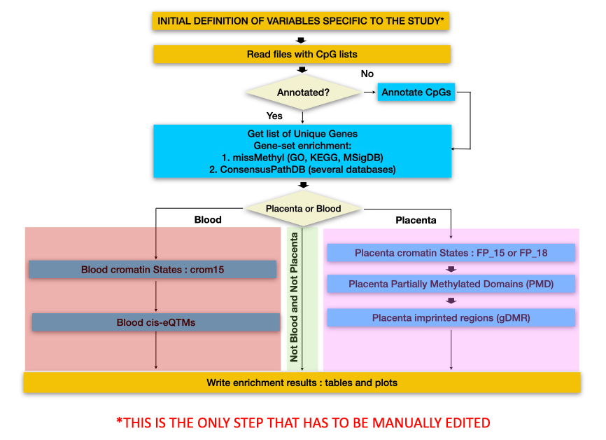

```{r setup_knitr, include=FALSE}
knitr::opts_chunk$set(message = FALSE, warning = FALSE,
                      cache=TRUE)
library(knitr)
```

# Prerequisites

The package requires other packages to be installed. These include: `ggplot2`, `VennDiagram`, `RColorBrewer`, `tibble`, `dplyr`, `stringr`, `rasterpdf`, `tidyverse`, `reshape`, `ggsignif`, `tools` and `meta` all available in CRAN. The package also requires other packages from Bioconductor to perform annotations and enrichment : `IlluminaHumanMethylation450kanno.ilmn12.hg19`, `IlluminaHumanMethylationEPICanno.ilm10b4.hg19`, `missMethyl`, `org.Hs.eg.db`, `GenomicRanges` and `rtracklayer`.

To perform meta-analyses we use GWAMA, a Software tool for meta analysis developed by Intitute of Genomics from University of Tartu, this software is available at [https://genomics.ut.ee/en/tools/gwama-download](https://genomics.ut.ee/en/tools/gwama-download), this software must be installed on the computer where we are running analysis (already installed in machines ws05 and ws06 from ISGlobal).

# Overview

The EASIER package performs epigenetic wide-association study (EWAS) downstream analysis:

* Quality control of EWAS results
    + Folders: input and ouput
    + Configuration: array type, sample, ethnic, exclusion CpGs criteria
    + CpG filtering selection -> list of CpGs filtered and reason
    + QC with summaries -> summary SE, Beta, lambda, significatives...
    + QC with plots -> QQplot, Distribution plot, precision plot, ...
    + CpG annotation and adjustment -> QCed EWAS results file

* Meta-analysis of EWAS results (using GWAMA)
    + Folders: input and output
    + Link to GWAMA
    + Format QCed EWAS results file
    + Run GWAMA -> EWAS meta-analysis results file
    + Meta-analysis with summaries -> xxxxxxx
    + Meta-analysis with plots -> Heterogeneity plot, distribution plots, QQ-plots, Volcano plots, Manhattan plots andForest plots, 

* Functional enrichment (pathway and molecular enrichments)


In this vignette we will show how to apply EASIER con the EWAS results from  three cohorts and two distinct models for each cohort.


# Getting started

First, we need to install and load the required packages

```{r installDependences, eval=FALSE}

if (!require(rasterpdf, quietly = TRUE)) 
   install.packages('rasterpdf', repos = 'https://cran.rediris.es/' )
if (!require(meta, quietly = TRUE)) 
   install.packages('meta', repos = 'https://cran.rediris.es/' )
if (!require(tibble, quietly = TRUE)) 
   install.packages('tibble')
if (!require(dplyr, quietly = TRUE)) 
   install.packages('dplyr')
if (!require(tidyverse, quietly = TRUE)) 
   install.packages::install( "tidyverse" )
if (!require(stringr, quietly = TRUE)) 
   install.packages('stringr')
if (!require(meta, quietly = TRUE)) 
   install.packages('meta') # Forest Plot
if (!require(ggplot2, quietly = TRUE)) 
   install.packages('ggplot2')
if (!require(VennDiagram, quietly = TRUE)) 
   install.packages('VennDiagram')
if (!require(RColorBrewer, quietly = TRUE)) 
   install.packages('RColorBrewer')
if (!require(reshape, quietly = TRUE)) 
   install.packages('reshape')
if (!require(ggsignif, quietly = TRUE)) 
   install.packages('ggsignif')
if (!require(tools, quietly = TRUE)) 
   install.packages('tools')


# Required libraries from Bioconductor
if (!requireNamespace("BiocManager", quietly = TRUE))
install.packages("BiocManager")

BiocManager::install( c("missMethyl",
                        "org.Hs.eg.db",
                        "GenomicRanges",
                        "rtracklayer") )
```

We also need to install `devtools` package, this package allows us to install packages directly from github

```{r installdevtools, eval=FALSE}
if (!require(devtools, quietly = TRUE)) install.packages('devtools')
```

The development version of `EASIER` package can be installed from BRGE GitHub repository:

```{r installEASIER, eval=FALSE}
devtools::install_github("isglobal-brge/EASIER@HEAD")
```

```{r loadMethyTools, eval=TRUE}
library(EASIER)
library(readtext)
```


# Quality control


## Quality Control Flowchart


```{r qcworkflow, echo=FALSE, out.width='100%',  fig.align='center',  fig.cap="\\label{fig:qcworkflow}Quality control flowchart. This flowchart is used in the script under test folder to perform the quality control (QuqlityControl.R). The most important step in this workflow is the first step where we have to define the variables, if variables are well defined all the process is 'automatic' ", fig.pos='ht'}
include_graphics("imgs/workflows/QCWorkflow.png") 
```


## Initial Variables definition


We need to define the variables to work in all Quality control process, and the files containing the results of the EWAS to perform the downstream analysis.

### Input data

As we commented before, we will perform an EWAS with three different cohorts and two distinct models for each cohort, so we need to define where the data is stored for each model and each cohort (six files). We do that in a character vector, and the variable is called files:

```{r QC_varfiles}

files <- c('data/PROJ1_Cohort3_Model1_date_v2.txt',
           'data/PROJ1_Cohort3_Model2_date_v2.txt',
           'data/PROJ1_Cohort2_Plate_ModelA1_20170309.txt',
           'data/PROJ1_Cohort2_Plate_ModelA2_20170309.txt',
           'data/Cohort1_Model1_20170713.txt',
           'data/Cohort1_Model2_20170713.txt')
```

files must contain at least the following fields : 


probeID   | BETA | SE | P_VAL
------- | ----- | ----- | -----
cg13869341 | 0.00143514362777834 | 0.00963411132344512 | 0.678945643213567
cg24669183 | -0.0215342789035512 | 0.0150948404044624 | 0.013452341234512
cg15560884 | 0.00156725345562218 | 0.0063878467810596 | 0.845523221223523


### Where to store output

We can also define the folder where we will save the results, for example in a variable called `result_folder`, in this case the results will be stored stored in a folder named *QC_Results*.

```{r QCVarres}
# Result folder
results_folder <- 'QC_Results'
```

### Make results understandable

To make the analysis more understandable and do not have very complex file names we have to define an abbreviated form for each of the files defined above. For example, PACE_AQUA_Model1_date_v2 will be treated as PACE_AQUA_A1 or PACE_INMA_Plate_ModelA2_20170309 as PACE_IMMA_A2. The length of the prefix vector must be equal to that of the files indicated above:

```{r QCVarPrefix}
# Prefixes for each file
prefixes <- c('PROJ1_Cohort3_A1', 'PROJ1_Cohort3_A2',
              'PROJ1_Cohort2_A1','PROJ1_Cohort2_A2', 
              'Cohort1_A1', 'Cohort1_A2')
```


### Illumina Array type and filter conditions

The Illumina array type has to be indicated with one of these two possible values: 450K and EPIC. Filter CpGs is dependent on the Illumina array, thus this field has to be completed. 

```{r QCVarartype}
# Array type, used : EPIC or 450K
artype <- '450K'
```

In the quality control (QC) process, we exclude those CpGs that do not accomplish the defined parameters (based on *Zhou et al. 2017, Solomon et al. 2018, Fernandez-Jimenez et al. 2019*). These parameters are defined in a character vector and are the following:

#### Perform CpG exclusions –> non CpG probes and sexual CpGs:

  * **Control probes ("control_probes")**: technical control probes that do not correspond to CpGs, such as bisulfite conversion I, bisulfite conversion II, extension, hybridization and negative. Classified as "rs" in the filtering variable named "probeType";
  * **Non-cpg probes ("noncpg_probes")**: non-cpg probes classified as "ch" in the filtering variable named "probeType";
  * **Sex chromosomes ("Sex")**: to avoid misleading results due to differences in sex-chromosome dosage on the human methylome. Filtering variable "Sex"; #

#### Perform CpG exclusions –> hybridizing problems:

  * **Poor mapping probes ("MASK_mapping")**: Probes that have poor quality mapping to the target genomic location as indicated in the array’s manifest file based on genome build GRCh37 and GRCh38 (for example due to the presence of INDELs (Insertion–deletion mutations present in the genome); 
  * **Cross-hybridising probes ("MASK_sub30")**: The sequence of the last 30bp at the 3’ end of the probe is non-unique (problematic because the beta value of such probes is more likely to represent a combination of multiple sites and not the level of initially targeted CpG sites); Zhou et al. recommend 30bp, but in the code we prepared there is the possibility to adapt this to probes with non-unique 25bp, or 35bp, or 40bp, or 45bp 3’-subsequences (**"MASK_sub25", "MASK_sub40", "MASK_sub45"**).

#### Perform CpG exclusions -> presence of SNPs:

  * **"MASK_extBase"**: Probes with a SNP altering the CpG dinucleotide sequence context and hence the ability of target cytosines to be methylated (regardless of the MAF); 
  * **"MASK_typeINextBaseSwitch"**: Probes with a SNP in the extension base that causes a color channel switch from the official annotation (regardless of the MAF); 
  * **"MASK_snp5.GMAF1p"**: probes with SNPs at the last 5bp of the 3’ end of the probe, with an average minor allele frequency (MAF) >1%, by ethnic group; 
  * **"MASK_snp5.common"**: probes with SNPs at the last 5bp of the 3’ end of the probe, with any average minor allele frequency (MAF) (can be <1%), by ethnic group;

#### Perform CpG exclusions -> array consistency:

  * **"Unrel_450_EPIC_blood"**: These are probes that are known to yield different results for the 450K and EPIC array in BLOOD, suggesting that results are unreliable for at least one of these arrays. CpGs based on Solomon et al. (2018).
  * **"Unrel_450_EPIC_pla_restrict"** or **"Unrel_450_EPIC_pla"**: These are probes that are known to yield different results for the 450K and EPIC array in PLACENTA, suggesting that results are unreliable for at least one of these arrays. CpGs based on Fernandez-Gutierrez et al. (2019).
 
In this example we filter CpGs that meet the following conditions: MASK_sub35_copy, MASK_typeINextBaseSwitch, noncpg_probes, control_probes, Unreliable_450_EPIC and Sex.


```{r QCVarexclude}
# Parameters to exclude CpGs
exclude <- c( 'MASK_sub35_copy', 
              'MASK_typeINextBaseSwitch', 
              'noncpg_probes', 
              'control_probes', 
              'Unrel_450_EPIC_blood', 
              'Sex')
```

We also need to define the ethnic origin of the study population. Ethnic origins can be one of the table or *GMAF1p* if population is very diverse.

| **Population Code** | **Population Description                                            ** | **Super Population Code** |
| :-------------------: | :---------------------------------------------------------------------- | :-------: |
| AFR                   | *African*                                                               | AFR       |
| AMR                   | *Ad Mixed Americn*                                                      | AMR       |
| EAS                   | *East Asian*                                                            | EAS       |
| EUR                   | *European*                                                              | EUR       |
| SAS                   | *South Asian*                                                           | SAS       |
| CHBB                  | Han Chinese in Beijing, China                                           | EAS       |
| JPT                   | Japanese in Tokyo, Japan                                                | EAS       |
| CHS                   | Southern Han Chinese                                                    | EAS       |
| CDX                   | Chinese Dai in Xishuangbanna, China                                     | EAS       |
| KHV                   | Kinh in Ho Chi Minh City, Vietnam                                       | EAS       |
| CEU                   | Utah Residents (CEPH) with Northern and Western European Ancestry       | EUR       |
| TSI                   | Toscani in Italia                                                       | EUR       |
| FIN                   | Finnish in Finland                                                      | EUR       |
| GBR                   | British in England and Scotland                                         | EUR       |
| IBS                   | Iberian Population in Spain                                             | EUR       |
| YRI                   | Yoruba in Ibadan, Nigeria                                               | AFR       |
| LWK                   | Luhya in Webuye, Kenya                                                  | AFR       |
| GWD                   | Gambian in Western Divisions in the Gambia                              | AFR       |
| MSL                   | Mende in Sierra Leone                                                   | AFR       |
| ESN                   | Esan in Nigeria                                                         | AFR       |
| ASW                   | Americans of African Ancestry in SW USA                                 | AFR       |
| ACBB                  | African Caribbeans in Barbados                                          | AFR       |
| MXL                   | Mexican Ancestry from Los Angeles USA                                   | AMR       |
| PUR                   | Puerto Ricans from Puerto Rico                                          | AMR       |
| CLM                   | Colombians from Medellin, Colombia                                      | AMR       |
| PEL                   | Peruvians from Lima, Peru                                               | AMR       |
| GIH                   | Gujarati Indian from Houston, Texas                                     | SAS       |
| PJL                   | Punjabi from Lahore, Pakistan                                           | SAS       |
| BEBB                  | Bengali from Bangladesh                                                 | SAS       |
| STU                   | Sri Lankan Tamil from the UK                                            | SAS       |
| ITU                   | Indian Telugu from the UK                                               | SAS       |
|                       |                                                                         |           |
| GMAF1p                | If population is very diverse                                           |           |


```{r QCVarethnic}
ethnic <- 'EUR'
```


### Other variables :

To obtain the precision plot and to perform the GWAMA meta-analysis we need to know the number of samples in the EWAS results, so we store this information in ”N”for each of the files. In addition, for case-control EWAS, we need to know the sample size of exposed or diseased individuals. This informaiotn is storaed as “n” for each of the files


```{r QCVarN}
N <- c(100, 100, 166, 166, 240, 240 )
n <- c(NA)
```

## Quality Control - general code


As we show in the Quality control Flowchart, this code can be executed for each file defined in previous variable `files` but in this examplewe only show the analysis workflow for one of them.

```{r QCCode1}

# Variable declaration to perform precision plot
medianSE <- numeric(length(files))
value_N <- numeric(length(files))
cohort_label <- character(length(files))

# Prepare output folder for results (create if not exists)
if(!dir.exists(file.path(getwd(), results_folder )))
   suppressWarnings(dir.create(file.path(getwd(), results_folder)))


# IMPORTANT FOR A REAL ANALYSIS :

# To show the execution flow we perform the analysis with only one data
# file. Normally, we have more than one data file to analyze, for that
# reason, we execute the code inside a loop and we follow the execution
# flow for each file defined in `files` 
# So we need to uncomment the for instruction and remove i <- 1 assignment.

# for ( i in 1:length(files) )
# {

   # we force i <- 1 to execute the analysis only for the first variable
   # for real data we have to remove this line
   i <- 1

```

First, we need to read the content of a file with EWAS results,

```{r QCCodeRead}
   
# Read data.
cohort <- read.table(files[i], header = TRUE, as.is = TRUE)
print(paste0("Cohort file : ",files[i]," - readed OK", sep = " "))
```

and store the content of the file in a `cohort` variable.  After that, we perform a simple descriptive analysis, using the function `descriptives_CpGs`. This function needs the EWAS results to be analyzed (`cohort`), the fields for which we are interested to get descriptives, ( BETA, SE and P_VAL (seq(2:4))), and a file name to write results. For the first file it would be: *QC_Results/PACE_AQUA_A1_descriptives_init.txt*

```{r QCCodeDescriptives}
# Descriptives - Before CpGs deletion
descriptives_CpGs(cohort, seq(2,4), paste0(results_folder,'/',prefixes[i],
                                           '_descriptives_init.txt') )

```

Then, we test if there are any duplicate CpGs. If there are duplicated CpGs, these are removed using the function `remove_duplicate_CpGs`. In this function we must indicate what data have to be reviewed and the field that contains the CpG IDs. Optionally, we can write the duplicates and descriptives related to this duplicates in a file.

```{r QCCodeRemovedupli}
# Remove duplicates
cohort <- remove_duplicate_CpGs(cohort, "probeID", 
                                paste0(results_folder,'/',prefixes[i],
                                       '_descriptives_duplic.txt'), 
                                paste0(results_folder,'/',prefixes[i],
                                       '_duplicates.txt') )

```

To exclude CpGs that we are not interested in, we use the function `exclude_CpGs`. Here we use the parameters defined before in the `exclude` variable, which are the data, cohort, the CpG id field (can be the column number or the field name "probeId"), the filters to apply defined in `exclude` variable, and, optionally, a file name if we want to save excluded CpGs and the exclusion reason (in this case the file name will be  *QC_Results/PACE_AQUA_A1_excluded.txt*).
\ 


```{r QCCodeexclCpGs}
# Exclude CpGs not meet conditions
cohort <- exclude_CpGs(cohort, "probeID", exclude, 
                       filename = paste0(results_folder,'/',prefixes[i],
                                         '_excluded.txt') )
```

After eliminating the inconsistent CpGs, we proceed to carry out another descriptive analysis,

```{r QCcodedesclast, eval=FALSE}
# Descriptives - After CpGs deletion #
descriptives_CpGs(cohort, seq(2,4), 
                  paste0(results_folder,'/',prefixes[i],
                         '_descriptives_last.txt') )
```

Now, we can get adjusted p-values by Bonferroni and False Discovery Rate (FDR). The function to get adjusted p-values is `adjust_data`, and we have to indicate in which column the p-value is and what adjustment we want. By default the function adjust data by Bonferroni (`bn`) and FDR (`fdr`).
This function, returns the input data with two new columns corresponding to these adjustments. As in other functions seen before, optionally, we can get a data summary with the number of significative values with bn, fdr, ....  in a text file, (the generated file in the example is called *QC_Results/PACE_AQUA_A1_ResumeSignificatives.txt* ).

```{r QCCodeAdjust}

# data before adjustment
head(cohort)

# Adjust data by Bonferroni and FDR
cohort <- adjust_data(cohort, "P_VAL", bn=TRUE, fdr=TRUE, 
                      filename =  paste0(results_folder,'/',prefixes[i],
                                         '_ResumeSignificatives.txt')  )

# data after adjustment
head(cohort)
```

Then EWAS results are annotated with the corresondign 450K or EPIC annotations and saved with the `write_QCData` function. The file generated by this function is the input for the meta-analysis with GWAMA. This data is stored with *_QC_Data.txt* sufix. In this function data is annotated before being written to the file,

```{r QCCodeWriteQData}
   # Write QC complete data to external file
   write_QCData(cohort, paste0(results_folder,'/',prefixes[i]))
```

## Quality Control - code for plots

To perform a graphical analysis we have different functions. We can easily generate a SE or p-value distribution plots with  `plot_distribution` function

```{r QCcodedistrplotse, echo=FALSE, fig.align='center',  fig.cap="\\label{fig:QCcodedistrplotse}SE distribution plot", fig.pos='ht'}
   ## Visualization - Plots

   # Distribution plot
   plot_distribution(cohort$SE, 
                     main = paste('Standard Errors of', prefixes[i]), 
                     xlab = 'SE')
```

```{r QCcodedistrplotpval, echo=FALSE,  fig.align='center',  fig.cap="\\label{fig:QCcodedistrplotpval}p-value distribution plot", fig.pos='ht'}
   ## Visualization - Plots

   plot_distribution(cohort$P_VAL, 
                     main = paste('p-values of', prefixes[i]), 
                     xlab = 'p-value')
```

```{r QCcodeqqplot, echo=FALSE,   fig.align='center',  fig.cap="\\label{fig:QCcodeqqplot}QQplot", fig.pos='ht'}
   # QQ plot.
   qqman::qq(cohort$P_VAL,
             main = sprintf('QQ plot of %s (lambda = %f)', prefixes[i], 
                            lambda = get_lambda(cohort,"P_VAL")))
```

```{r QCCodeVolcanoplot, echo=FALSE, out.width='100%',  fig.align='center',  fig.cap="\\label{fig:QCCodeVolcanoplot}Volcano Plot", fig.pos='ht'}
   # Volcano plot.
   plot_volcano(cohort, "BETA", "P_VAL", main=paste('Volcano plot of', prefixes[i]) )

```

When we have the results for all models and cohorts, we can perform a Precision plot with `plot_precisionp` function 

```{r invchr17, echo=FALSE, out.width='100%',  fig.align='center',  fig.cap="\\label{fig:invchr17}Precision plot for 10 different datasets ", fig.pos='ht'}
include_graphics("imgs/precision_SE_N.png") 
```

Venn diagrams are obtained with function `plot_venndiagram`,. We need to define the venn diagram for a maximum of 5 datasets. Here we define which models and cohorts we want to be shown in the Venn diagram. In this example we define two different Venn diagrams, one with  "PACE_AQUA_A1", "PACE_IMMA_A1" and "RICHS_A1" datasets and the other with three more datasets "PACE_AQUA_A2", "PACE_IMMA_A2" and "RICHS_A2"

```{r QCVarvenn, eval=FALSE}
# Venn diagrams
venn_diagrams <- list(
   c("PACE_AQUA_A1", "PACE_IMMA_A1", "RICHS_A1" ),
   c("PACE_AQUA_A2", "PACE_IMMA_A2", "RICHS_A2" )
)
```


# Meta-Analysis with GWAMA

## Meta-Analysis flowchart


```{r metaworkflow, echo=FALSE, out.width='100%',  fig.align='center',  fig.cap="\\label{fig:metaworkflow}Meta-analysis flowchart. This flowchart is used in the script under test folder to perform the quality control (MetaAnalysis.R). The most important step in this workflow is the first step where we have to define the variables, if variables are well defined all the process is 'automatic' ", fig.pos='ht'}
include_graphics("imgs/workflows/MetaAnalysisWorkflow.png") 
```


Like in QC analysis, in Meta-analysis we need to define some variables. One of this variables is the one that refers to the data of each meta-analysis.  For example, in `metafiles` variable we have defined three different meta-analysis, MetaA1, MetaA2 and MetaB. In the first one, MetaA1, we have the datasets ‘PACE_AQUA_A1’, ‘PACE_IMMA_A1’ and ‘RICHS_A1’, and we can use the simplified form to make all the study more understandable

We can also exclude those CpGs with low representation in meta-analysis, we can set the minimum percentage with `pcentMissing` variable. In this example, we take into account all CpGs present in at least 80% of the datasets of the meta-analysis. We execute the meta-analysis twice, one with all CpGs and other with only CpGs with presence higher than the indicated in `pcentMissing`.

```{r meta_variables, eval=FALSE}

## -- Variable definition for Meta-Analysis -- ##

# Array type, used : EPIC or 450K
artype <- '450K'

# Define data for each meta-analysis
metafiles <- list(
   'MetaA1' = c('PACE_AQUA_A1','PACE_IMMA_A1', 'RICHS_A1' ),
   'MetaA2' = c('PACE_AQUA_A2','PACE_IMMA_A2', 'RICHS_A2' ),
   'MetaB' = c('PACE_IMMA_B1','PACE_IMMA_B2'))

# Define maximum percent missing for each CpG
pcentMissing <- 0.8 # CpGs with precense lower than pcentMissing after EWAS
                    # meta-analysis will be deleted from the study.

# Paths with QCResults and path to store GWAMA results
results_folder <- 'QC_Results'
results_gwama <- '.'

```

Now, we define the GWAMA execution path for ISGlobal Servers 05 and 06.  

```{r metaFolders, eval=FALSE}

## Create directory for GWAMA configuration files and GWAMA_Results 
## inside the defined results_gwama variable defined before.
if(!dir.exists(file.path(getwd(), paste(results_gwama, "GWAMA", sep="/") )))
   suppressWarnings(dir.create(file.path(getwd(), paste(results_gwama, "GWAMA", sep="/"))))

## Create directory for GWAMA_Results
outputfolder <- paste0(results_gwama, "/GWAMA_Results")
if(!dir.exists(file.path(getwd(), outputfolder )))
   suppressWarnings(dir.create(file.path(getwd(), outputfolder)))

# We create a map file for GWAMA --> Used in Manhattan plots.
# We only need to indicate the array type
hapmapfile <- paste(results_gwama,"GWAMA", "hapmap.map" ,sep = "/")
generate_hapmap_file(artype, hapmapfile)


```

In this example we only get the first meta-analysis with all CpGs and with CpGs with missing data lower than pcentMissing but in a complete script all meta-analyses are performed for both cases: complete and lowCpGs.

First, we must create the needed folders. In this example we create a GWAMA folder where we will put the input files for GWAMA, and GWAMA_Results folder where we will store all the results.


```{r metaFolders2, eval=FALSE}
   
   list.lowCpGs <- NULL

   # Create folder for a meta-analysis in GWAMA folder, here we 
   # store the GWAMA input files for each meta-analysis,
   # We create one for complete meta-analysis
   if(!dir.exists(file.path(getwd(), 
                            paste(results_gwama,"GWAMA", names(metafiles)[metf],
                                  sep="/") )))
      suppressWarnings(dir.create(file.path(getwd(), 
                                            paste(results_gwama,"GWAMA", 
                                                  names(metafiles)[metf], 
                                                  sep="/"))))
   # We create another for meta-analysis without filtered CpGs with low 
   # percentage (sufix _Filtr)
   if(!dir.exists(file.path(getwd(), 
                            paste0(results_gwama,"/GWAMA/", 
                                   names(metafiles)[metf],
                                   "_Filtr") )))
      suppressWarnings(dir.create(file.path(getwd(), 
                                            paste0(results_gwama, "/GWAMA/",
                                                   names(metafiles)[metf],
                                                   "_Filtr"))))

   # GWAMA File name base
   inputfolder <- paste0(results_gwama,"/GWAMA/",  names(metafiles)[metf])

   modelfiles <- unlist(metafiles[metf])

   # Execution with all CpGs and without filtered CpGs
   runs <- c('Normal', 'lowcpgs') 
   lowCpGs = FALSE;
   outputfiles <- list()

   outputgwama <- paste(outputfolder,names(metafiles)[metf],sep = '/')
   
```

To perform meta-analyses we use GWAMA, a Software tool for meta-analysis developed by Intitute of Genomics from University of Tartu. This software is available at  [https://genomics.ut.ee/en/tools/gwama-download](https://genomics.ut.ee/en/tools/gwama-download). As mentioned before it must be installed on the computer where we are running analysis and the installation path must be defined in `gwama.dir` variable:

```{r metaVarGwama, eval=FALSE}

# GWAMA binary path  (GWAMA IsGlobal Server 05 and 06 installation)
gwama.dir <- paste0(Sys.getenv("HOME"), 
                    "/data/EWAS_metaanalysis/1_QC_results_cohorts/GWAMA/")

```


Now we are ready to execute the analysis. First of all, we need to generate files with predefined format by GWAMA. To do that, we use the function `create_GWAMA_files`. In this function we have to specify the gwama folder created before, a character vector with models present in meta-analysis (previously defined in metafiles variable), the folder with original data (these are the QC_Data output files from QC), the number of samples in the study, and we need to indicate if this is the execution with all CpGs or not (if not, we indicate the list with excluded CpGs, which can be obtained with `get_low_presence_CpGs` function.

`create_GWAMA_files` function takes the original files and converts them to the GWAMA format, it also creates the .ini file necessary to run GWAMA 

When we have all the files ready to execute GWAMA, we proceed to its execution with `run_GWAMA_MetaAnalysis` function. This function needs to know:

* the folder with data to be analysed, (this is the GWAMA folder),
* where to store the results (by default this function creates a subfolder with meta-analysis name and stores all the results together),
* the meta-analysiss name,
* where is the GWAMA binary installed,

GWANA is executed by fixed and random effects. The function `run_GWAMA_MetaAnalysis` function generates one .out file with meta-analysis results, and the associated Manhattan plots and  QQ plots, one for fixed effects and another for random effects.

```{r metaAnalys, eval=FALSE}
for(j in 1:length(runs))
{
   if(runs[j]=='lowcpgs') {
      lowCpGs = TRUE
      # Get low presence CpGs in order to exclude this from the new meta-analysis
      list.lowCpGs <- get_low_presence_CpGs(outputfiles[[j-1]], pcentMissing)
      inputfolder <- paste0(results_gwama,"/GWAMA/",  names(metafiles)[metf], "_Filtr")
      outputgwama <- paste0(outputgwama,"_Filtr")
   }

   # Create a GWAMA files for each file in meta-analysis and one file with 
   # gwama meta-analysis configuration
   for ( i in 1:length(modelfiles) )
      create_GWAMA_files(results_folder,  modelfiles[i], 
                         inputfolder, N[i], list.lowCpGs )

   # Execute GWAMA meta-analysis and manhattan-plot, QQ-plot and a file 
   # with gwama results.
   outputfiles[[runs[j]]] <- run_GWAMA_MetaAnalysis(inputfolder, 
                                                    outputgwama, 
                                                    names(metafiles)[metf], 
                                                    gwama.dir)
```

```{r manhat, echo=FALSE, out.width='100%',  fig.align='center',  fig.cap="\\label{fig:manhat}Manhattan plot obtained with GWAMA ", fig.pos='ht'}
include_graphics("imgs/Manhat.png") 
```

After getting the GWAMA results, we perform an analysis with `get_descriptives_postGWAMA` function (similar to what was done in the QC procedure but with meta-analysis results). This function adjusts p-values, annotates CpGs, and generates a file with descriptive results and plot heterogeneity distribution, SE distribution, p-values distribution, QQ-plot with lambda, and the volcano plot.

To finish we generate the ForestPlot associated to the first 30 top significative CpGs.

```{r metaAnalys2, eval=FALSE}
   # Post-metha-analysis QC --- >>> adds BN and FDR adjustment
   dataPost <- get_descriptives_postGWAMA(outputgwama, 
                                          outputfiles[[runs[j]]], 
                                          modelfiles, 
                                          names(metafiles)[metf], 
                                          artype, 
                                          N[which(prefixes %in% modelfiles)] )

   # Forest-Plot
   plot_ForestPlot( dataPost, metafiles[[metf]], runs[j], 
                    inputfolder, names(metafiles)[metf], files, outputgwama  )

}

```

```{r heteroi2, echo=FALSE, out.width='80%',  fig.align='center',  fig.cap="\\label{fig:heteroi2}Heterogeneity distribution plot (i2) ", fig.pos='ht'}
include_graphics("imgs/Heteroi2.png") 
```

```{r Forestplot, echo=FALSE, out.width='100%',  fig.align='center',  fig.cap="\\label{fig:Forestplot}Forest plot for cpg22718050 ", fig.pos='ht'}
include_graphics("imgs/FP_cg22718050.png") 
```


# Enrichment

## Enrichment Flowchart

```{r enrichworkflow, echo=FALSE, out.width='110%',  fig.align='center',  fig.cap="\\label{fig:enrichworkflow}Enrichment flowchart. This flowchart is used in the script under test folder to perform the enrichment (Enrichment.R). The most important step in this workflow is the first step where we have to define the variables, if variables are well defined all the process is 'automatic' ", fig.pos='ht'}
 
```


## Functional enrichment - Based on CpGs

### GO and KEGG


### Functional enrichment - Based on Genes


## Molecular enrichment - Based on CpGs

### Pathways with Molecular Signatures Database (MSigDB)


# Session info {.unnumbered}

```{r sessionInfo, echo=FALSE}
sessionInfo()
```
